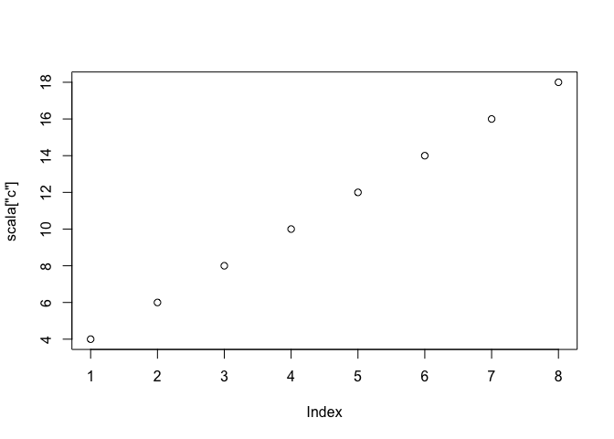

# Scala QuickStart

The following sets up the Scala evaluation environment.

```r
library(jvmr)
library(knitr)
scala <- scalaInterpreter()
knit_engines$set(scalar = function(options) {
  code <- paste(options$code, collapse = "\n")
  output <- capture.output(interpret(scala, code, echo.output = TRUE))
  engine_output(options, options$code, output)
})
```

Now we can create some values in Scala

```scalar
val a = 2
```

```
## a: Int = 2
## [1] 2
```

Value persist across different chunks

```scalar
val b = (a until 10)
```

```
## b: scala.collection.immutable.Range = Range(2, 3, 4, 5, 6, 7, 8, 9)
## [1] "Java-Object{Range(2, 3, 4, 5, 6, 7, 8, 9)}"
```

Regular chunk options still apply such as `results='hide'`

```scalar
val c = b.map(_ * a).toArray
```

You can use results across R as well

```r
plot(scala["c"])
```

 
